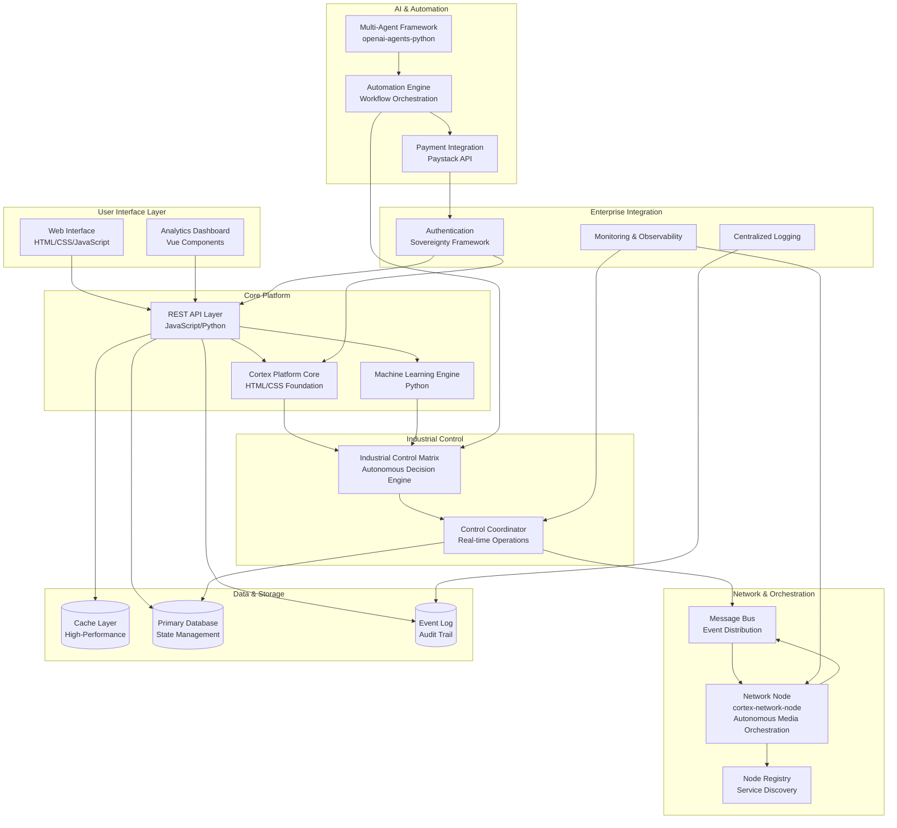

# Cortex Platform - Complete Architecture Overview

Comprehensive system architecture for the Cortex Intelligence Nexus Intel Solution, showcasing autonomous AI architectures, industrial control matrices, and enterprise automation.

## System Architecture Diagram



## Core Components

### 1. User Interface Layer
- **Web Interface**: HTML/CSS/JavaScript frontend for interactive user experiences
- **Analytics Dashboard**: Vue.js components providing real-time metrics and monitoring

### 2. Core Platform Foundation
- **Cortex Platform Core**: HTML/CSS infrastructure and layout systems
- **REST API Layer**: JavaScript/Python-based API gateway for component communication
- **Machine Learning Engine**: Python-based models enabling autonomous decision-making

### 3. Industrial Control Subsystem
- **Industrial Control Matrix**: Autonomous decision engine orchestrating industrial operations
- **Control Coordinator**: Real-time operations manager maintaining system consistency

### 4. Network & Orchestration Layer
- **Autonomous Network Node**: Distributed media orchestration and P2P networking
- **Message Bus**: Event-driven architecture enabling async component communication
- **Node Registry**: Service discovery and network topology management

### 5. Data & Persistence Layer
- **Cache Layer**: High-performance in-memory caching for optimized data access
- **Primary Database**: Persistent state management and transaction storage
- **Event Log**: Immutable audit trail and event sourcing

### 6. Enterprise Integration
- **Authentication System**: Sovereignty-aware access control and identity management
- **Monitoring & Observability**: System health tracking and performance analytics
- **Centralized Logging**: Aggregated logs and diagnostics

### 7. AI & Automation Engine
- **Multi-Agent Framework**: Lightweight agent-based workflow execution (openai-agents-python)
- **Automation Engine**: Orchestrates complex business processes and automations
- **Payment Gateway Integration**: Paystack API for transaction processing

## Technology Stack Summary

| Layer | Technologies |
|-------|--------------|
| **Frontend** | HTML (89.8%), CSS (2.3%), JavaScript (5.2%), Vue.js (0.3%) |
| **Backend** | Python (2.3%), JavaScript/Node.js |
| **AI/ML** | Python, Multi-agent frameworks, LLM integration |
| **Infrastructure** | Autonomous network nodes, distributed messaging |
| **Databases** | Primary state store, event log, cache layer |
| **Integration** | REST APIs, Message Bus, Event-driven, Paystack |
| **DevOps** | GitHub Actions, CI/CD pipelines, Cloud infrastructure |

## Repository Architecture

```
Cortex-Nexus-Sovereign-Industrial-AI/
├── cortex-platform/                    # Main platform (89.8% HTML, 5.2% JS, 2.3% Python)
│   ├── assets/                         # Static resources
│   ├── scripts/                        # Automation and compilation
│   └── README.md                       # Project documentation
│
├── cortex-platform-core/               # Foundation layer (82.6% HTML, 17.4% CSS)
│   └── UI infrastructure components
│
├── cortex-network-node/                # Autonomous networking
│   └── Media orchestration and P2P
│
├── mikecomplexai-7-cortex-platform/   # Extended features (63.3% HTML, 36.7% CSS)
│   └── Enhanced UI components
│
└── .github/                            # GitHub configuration
    └── Workflows and automation
```

## Key Architectural Principles

✅ **Autonomous AI** - Self-managing decision engines with minimal human intervention
✅ **Industrial Grade** - Robust control matrices for mission-critical operations
✅ **Enterprise Ready** - Sovereignty-aware authentication and audit trails
✅ **Distributed** - Autonomous network nodes enabling horizontal scalability
✅ **Event-Driven** - Async communication through message bus architecture
✅ **Secure** - Multi-layered authentication and authorization
✅ **Observable** - Comprehensive monitoring and centralized logging
✅ **Extensible** - Pluggable components for custom integrations

## Data Flow Architecture

**Request Flow:**
```
User → UI/Dashboard → REST API → Core Platform → ML Engine → Decision Engine
```

**Event Flow:**
```
Decision Engine → Message Bus → Network Nodes → Event Log → Monitoring
```

**State Management:**
```
Operations → Database ← Cache Layer → API → Dashboard
```

---

> Consolidated from root ARCHITECTURE.md into official docs hierarchy.
> **Last Updated:** 2026-08-25 | **Version:** 2.0
