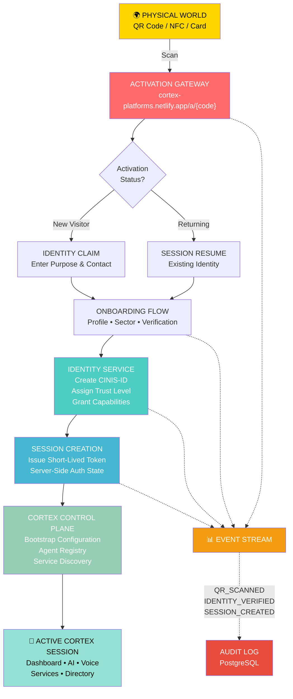
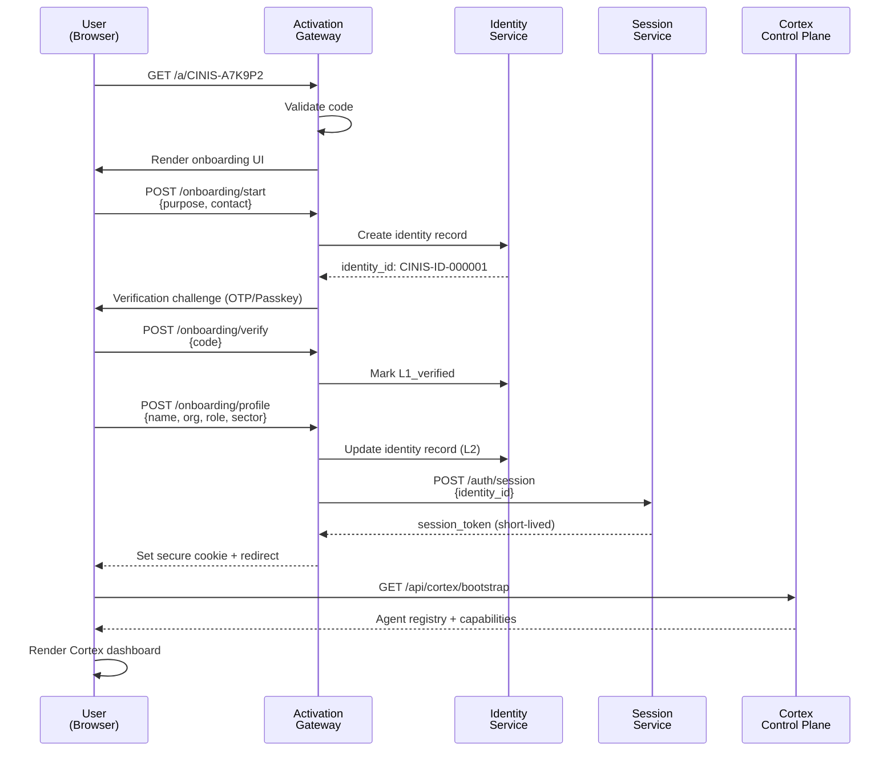
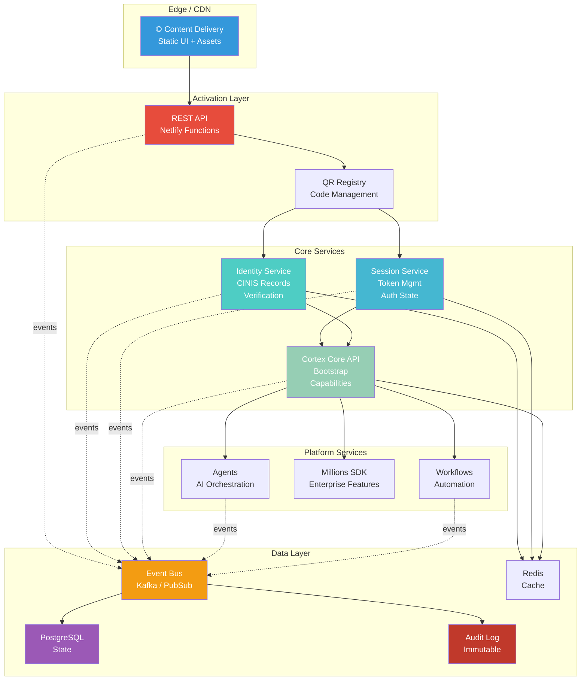
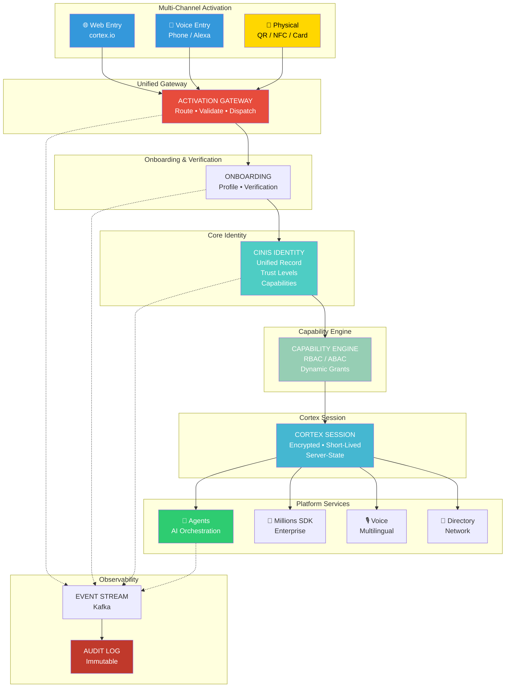

# CINIS Physical Activation Architecture

## Overview

The CINIS Physical Activation system transforms printed QR codes, NFC cards, and physical assets into controlled entry points for the Cortex Intelligence Nexus platform. This document defines the complete architecture, from physical scanning to active Cortex session.

**Core Principle:** The QR code is a gateway, not a credential. Identity, verification, and authorization happen server-side through a progressive onboarding flow.

---

## System Architecture



---

## Activation Code Model

Every QR code is backed by an opaque, rotatable activation identifier:

```
QR Label: CINIS-A7K9P2
URL: https://cortex-platforms.netlify.app/a/CINIS-A7K9P2

Server Registry:
{
  "activation_id": "CINIS-A7K9P2",
  "campaign": "physical-activation",
  "site": "CINIS-STUDIO",
  "status": "active",
  "destination": "onboarding",
  "created_at": "2026-09-06T00:00:00Z",
  "expires_at": null
}
```

**Key Advantage:** Change what the QR does without reprinting it.

---

## Identity Model

### CINIS Identity Record

Every onboarded participant receives a unique, persistent internal identifier:

```
CINIS-ID-000001
CINIS-ID-000002
CINIS-ID-000003
```

**Do NOT use email address as primary identity.**

### Identity Record Schema

```json
{
  "identity_id": "CINIS-ID-000001",
  "display_name": "John Doe",
  "organization": "Ogoja Industries",
  "role": "Engineer",
  "sector": "Industrial",
  "contact_method": "email",
  "verification_level": "L2",
  "created_at": "2026-09-06T10:00:00Z",
  "last_seen_at": "2026-09-06T15:30:00Z",
  "status": "active"
}
```

### Verification Levels

| Level | Meaning | Use Case |
|-------|---------|----------|
| **L0** | Anonymous visitor | Pre-registration exploration |
| **L1** | Contact verified | Email/phone OTP confirmed |
| **L2** | Identity verified | Profile complete & authenticated |
| **L3** | Organization verified | Employer/org confirmed |
| **L4** | Authorized operator | Cleared for service access |
| **L5** | Administrative authority | CINIS control-plane admin |

---

## Onboarding Flow



### Step 1: Purpose Declaration

```
> Welcome to Cortex Intelligence Nexus

You arrived through a verified CINIS activation point.

What brings you here?

[ ] Explore Cortex
[ ] Join the Network
[ ] Business / Organization
[ ] Developer
[ ] Partner
[ ] Support
```

### Step 2: Identity

- Name
- Preferred contact (email/phone)
- Organization
- Role

### Step 3: Sector Classification

- Industrial
- Agriculture
- Business
- Education
- Government
- Community
- Developer
- Other

### Step 4: Verification

Choose authentication mechanism:

- **Email OTP** — One-time password via email
- **Phone OTP** — SMS-based verification
- **Passkey** — FIDO2/WebAuthn credential
- **OAuth** — Federated identity (future)

---

## Capability-Based Access Control

After verification, the identity receives a capability set:

### Standard User

```json
{
  "identity": "CINIS-ID-000001",
  "trust": "L2",
  "capabilities": [
    "platform.read",
    "directory.read",
    "ai.query",
    "voice.use"
  ]
}
```

### Administrator

```json
{
  "identity": "CINIS-ID-000099",
  "trust": "L5",
  "capabilities": [
    "platform.read",
    "platform.write",
    "agent.manage",
    "workflow.manage",
    "identity.manage",
    "audit.read"
  ]
}
```

**Advantages:**
- Zero-trust model aligned with Cortex ADR
- Granular permission control
- Audit-friendly
- Easily extended for new services

---

## Backend Topology



---

## API Surface

### Activation Endpoints

```
GET    /api/activation/:code
POST   /api/activation/:code/scan
GET    /api/activation/:code/analytics
```

**Example Request:**

```bash
GET /api/activation/CINIS-A7K9P2
```

**Example Response:**

```json
{
  "valid": true,
  "campaign": "CINIS-STUDIO",
  "mode": "onboarding",
  "requires_auth": false,
  "destination": "onboarding"
}
```

**⚠️ Never return secrets or credentials in activation responses.**

### Onboarding Endpoints

```
POST   /api/onboarding/start
POST   /api/onboarding/profile
POST   /api/onboarding/verify
```

### Authentication Endpoints

```
POST   /api/auth/session
GET    /api/auth/me
POST   /api/auth/logout
```

### Cortex Bootstrap

```
GET    /api/cortex/bootstrap
GET    /api/cortex/capabilities
```

---

## Database Schema

### activation_codes

```sql
CREATE TABLE activation_codes (
  id SERIAL PRIMARY KEY,
  code_hash VARCHAR(255) UNIQUE NOT NULL,
  campaign_id VARCHAR(50),
  destination VARCHAR(50),
  status VARCHAR(20),
  created_at TIMESTAMP DEFAULT NOW(),
  expires_at TIMESTAMP,
  INDEX (code_hash),
  INDEX (campaign_id)
);
```

### activation_events

```sql
CREATE TABLE activation_events (
  id BIGSERIAL PRIMARY KEY,
  activation_id INT REFERENCES activation_codes(id),
  event_type VARCHAR(50),
  session_id VARCHAR(255),
  timestamp TIMESTAMP DEFAULT NOW(),
  metadata JSONB,
  INDEX (activation_id),
  INDEX (timestamp)
);
```

### identities

```sql
CREATE TABLE identities (
  id SERIAL PRIMARY KEY,
  display_name VARCHAR(255),
  organization VARCHAR(255),
  role VARCHAR(100),
  sector VARCHAR(50),
  verification_level INT DEFAULT 0,
  status VARCHAR(20),
  created_at TIMESTAMP DEFAULT NOW(),
  last_seen_at TIMESTAMP,
  INDEX (verification_level)
);
```

### identity_contacts

```sql
CREATE TABLE identity_contacts (
  id SERIAL PRIMARY KEY,
  identity_id INT REFERENCES identities(id),
  type VARCHAR(20),
  value_hash VARCHAR(255),
  verified_at TIMESTAMP,
  INDEX (identity_id),
  INDEX (type)
);
```

### sessions

```sql
CREATE TABLE sessions (
  id SERIAL PRIMARY KEY,
  identity_id INT REFERENCES identities(id),
  session_token_hash VARCHAR(255) UNIQUE,
  created_at TIMESTAMP DEFAULT NOW(),
  expires_at TIMESTAMP,
  revoked_at TIMESTAMP,
  INDEX (identity_id),
  INDEX (expires_at)
);
```

### capabilities

```sql
CREATE TABLE capabilities (
  id SERIAL PRIMARY KEY,
  identity_id INT REFERENCES identities(id),
  capability VARCHAR(100),
  granted_at TIMESTAMP DEFAULT NOW(),
  INDEX (identity_id),
  UNIQUE (identity_id, capability)
);
```

### audit_events

```sql
CREATE TABLE audit_events (
  id BIGSERIAL PRIMARY KEY,
  identity_id INT REFERENCES identities(id),
  event_type VARCHAR(50),
  resource VARCHAR(255),
  timestamp TIMESTAMP DEFAULT NOW(),
  metadata JSONB,
  INDEX (identity_id),
  INDEX (timestamp)
);
```

---

## Event Model & Lifecycle

Every activation generates a complete event trail:

```
QR_SCANNED
   ↓ (gateway validates code)
ACTIVATION_STARTED
   ↓ (user begins onboarding)
ONBOARDING_STARTED
   ↓ (user enters profile)
PROFILE_CREATED
   ↓ (verification challenge issued)
CONTACT_VERIFICATION_SENT
   ↓ (user confirms OTP/Passkey)
CONTACT_VERIFIED
   ↓ (identity record finalized)
IDENTITY_CREATED
   ↓ (identity marked verified)
IDENTITY_VERIFIED
   ↓ (session token issued)
SESSION_CREATED
   ↓ (user redirected to Cortex)
CORTEX_ACTIVATED
   ↓ (user opens AI/Voice/Service)
SERVICE_OPENED
   ↓
AI_QUERY_STARTED
   ↓
AI_QUERY_COMPLETED
   ↓ (user logs out or session expires)
SESSION_REVOKED
   ↓
IDENTITY_REVOKED (if requested)
```

**Event Structure:**

```json
{
  "event": "QR_SCANNED",
  "activation_id": "CINIS-A7K9P2",
  "timestamp": "2026-09-06T10:15:00Z",
  "session_id": "sess_abc123",
  "device": "mobile",
  "referrer": "CINIS-STUDIO",
  "campaign": "physical-activation",
  "metadata": {
    "ip_country": "NG",
    "user_agent": "Mozilla/5.0..."
  }
}
```

---

## Security Rules

### Trust Boundary

```
┌─────────────────────────────┐
│     UNTRUSTED BROWSER       │
│                             │
│  • QR code (public)         │
│  • Activation URL (public)  │
│  • Session cookie (encrypted)│
│                             │
│  ✗ NO API keys              │
│  ✗ NO database credentials  │
│  ✗ NO admin tokens          │
└──────────────┬──────────────┘
               │
     Netlify Functions
     (Trust Boundary)
               │
┌──────────────▼──────────────┐
│    PROTECTED SERVICES       │
│                             │
│  • Validate code            │
│  • Authenticate session     │
│  • Authorize capabilities   │
│  • Rate-limit requests      │
│  • Audit logging            │
└──────────────┬──────────────┘
               │
┌──────────────▼──────────────┐
│   CORTEX CORE (ENCRYPTED)   │
│                             │
│  • Service-to-service mTLS  │
│  • RBAC/ABAC                │
│  • Encrypted secrets        │
│  • Comprehensive audit      │
└─────────────────────────────┘
```

### Security Checklist

- [ ] Never include identity, API keys, or tokens in QR code or URL
- [ ] Hash activation codes in database; compare hashes at validation
- [ ] Use short-lived session tokens (15-60 minutes)
- [ ] Validate session state server-side for every API call
- [ ] Rate-limit activation gateway (10 req/min per IP)
- [ ] Log all identity operations immutably
- [ ] Use HTTPS/TLS for all communication
- [ ] Implement CSRF protection on session-issuing endpoints
- [ ] Hash contact information (email, phone) in database
- [ ] Encrypt metadata in event logs
- [ ] Implement capability audit trail

---

## QR Lifecycle

Every activation code progresses through a controlled lifecycle:

```
CREATED
   │ (code registered, awaiting first scan)
   ▼
ACTIVE
   │ (code is accepting scans)
   ▼
MONITORED
   │ (tracking usage patterns)
   ▼
ROTATED
   │ (new code issued, old code deprecated)
   ▼
REVOKED
   └─ (compromised or end-of-life)
```

**Example: Handle Compromised QR**

```bash
POST /api/admin/activation/CINIS-A7K9P2/revoke
{
  "reason": "physical_asset_compromised",
  "revoked_by": "admin-id",
  "timestamp": "2026-09-06T15:00:00Z"
}
```

This invalidates the QR without affecting the entire platform.

---

## Physical Network Model

Every printed QR becomes a network node:

```
CINIS NETWORK
│
├── Ogoja
│   ├── Studio (CINIS-STUDIO-001)
│   ├── Flyer (CINIS-FLYER-001)
│   └── Event (CINIS-EVENT-001)
│
├── Calabar
│   ├── Partner (CINIS-PARTNER-001)
│   └── Event (CINIS-EVENT-002)
│
├── Online
│   ├── Website (CINIS-WEB-001)
│   ├── Social (CINIS-SOCIAL-001)
│   └── Campaign (CINIS-CAMPAIGN-001)
│
└── Industrial Edge
    ├── Manufacturing (CINIS-MFG-001)
    ├── Agriculture (CINIS-AGR-001)
    └── Supply Chain (CINIS-SUPPLY-001)
```

### Network Analytics

Track complete funnel:

```
Physical Node
     ↓ (scans)
Anonymous Session
     ↓ (identifies self)
Identity Record
     ↓ (completes onboarding)
Verified User
     ↓ (joins network)
Active Session
     ↓ (queries AI / uses service)
Service Usage
     ↓
Partnership / Feedback
```

**Dashboard View:**

```
CINIS STUDIO (OGOJA)
├── Total Scans: 1,247
├── Activation Rate: 42% (525 completed)
├── Verified Identities: 389
├── Active Sessions (24h): 156
├── AI Queries: 2,847
└── Avg Session Duration: 8:30
```

---

## Deployment Sequence

### Phase 1: Activation Gateway (Week 1-2)

- [ ] Implement `/a/:code` endpoint
- [ ] Build QR registry & validation
- [ ] Emit scan events
- [ ] Create activation analytics dashboard

### Phase 2: Identity Service (Week 3-4)

- [ ] Create identity record model
- [ ] Implement CINIS-ID generation
- [ ] Support OTP/Passkey authentication
- [ ] Build session management
- [ ] Define verification levels

### Phase 3: Onboarding Flow (Week 5-6)

- [ ] Design multi-step UI
- [ ] Implement role/sector selection
- [ ] Build profile form
- [ ] Implement consent flow
- [ ] Assign initial capabilities

### Phase 4: Cortex Bridge (Week 7-8)

- [ ] Implement `/api/cortex/bootstrap`
- [ ] Connect capability service
- [ ] Enable agent access gating
- [ ] Integrate voice interface
- [ ] Connect directory

### Phase 5: Event & Audit (Week 9-10)

- [ ] Implement event schema
- [ ] Build event streaming pipeline
- [ ] Create immutable audit trail
- [ ] Add filtering & search to logs
- [ ] Implement retention policies

### Phase 6: Physical Network (Week 11-12)

- [ ] Assign QR IDs to physical assets
- [ ] Create node registry
- [ ] Implement geo-tagging
- [ ] Build multi-node analytics
- [ ] Create network dashboard

### Phase 7: Operations & Monitoring (Week 13+)

- [ ] Build activation dashboard
- [ ] Implement conversion funnel
- [ ] Add QR health checks
- [ ] Create identity usage reports
- [ ] Implement anomaly detection

---

## Target End State



---

## Implementation Checklist

### Core Infrastructure

- [ ] Netlify Functions deployment configured
- [ ] PostgreSQL cluster provisioned
- [ ] Redis cluster configured
- [ ] Kafka/Event bus setup
- [ ] Audit log storage
- [ ] CDN/Static asset delivery

### Activation Gateway

- [ ] QR code validation
- [ ] Activation code routing
- [ ] Scan event emission
- [ ] Rate limiting
- [ ] CORS configuration

### Identity Service

- [ ] Identity record CRUD
- [ ] CINIS-ID generation
- [ ] Contact hashing
- [ ] Verification level tracking
- [ ] Capability management

### Onboarding

- [ ] Multi-step form UI
- [ ] Progress persistence
- [ ] OTP delivery (email/SMS)
- [ ] Passkey registration
- [ ] Consent collection

### Session Management

- [ ] Token generation & validation
- [ ] Session TTL enforcement
- [ ] Server-side state tracking
- [ ] Revocation handling
- [ ] Secure cookie setup

### Cortex Integration

- [ ] Bootstrap API
- [ ] Capability-gated service access
- [ ] Agent registry connection
- [ ] Voice interface integration
- [ ] Directory synchronization

### Observability

- [ ] Event schema definition
- [ ] Event pipeline setup
- [ ] Audit trail logging
- [ ] Alerting rules
- [ ] Dashboard creation

---

## Glossary

| Term | Definition |
|------|-----------|
| **Activation Code** | Opaque identifier used in QR code; maps to activation record |
| **CINIS** | Cortex Intelligence Nexus Intel Solution; parent organization/framework |
| **CINIS-ID** | Unique internal identity identifier (e.g., CINIS-ID-000001) |
| **Trust Level** | Verification state of an identity (L0-L5) |
| **Capability** | Granular permission grant (e.g., `platform.read`, `ai.query`) |
| **Session** | Authenticated state with short-lived token; server maintains state |
| **Onboarding** | Multi-step process to collect profile & verify identity |
| **Event** | Immutable record of state change in system |
| **Audit Trail** | Complete log of all identity & authorization events |

---

## References

- ADR: Zero-Trust Architecture
- ADR: Event-Driven Platform Design
- Cortex Repository: Netlify Functions Configuration
- CINIS Physical Assets: Ogoja QR/Flyer Collection

---

**Document Version:** 1.0  
**Last Updated:** 2026-09-06  
**Status:** Architecture Reference  
**Author:** Cortex Intelligence Design
